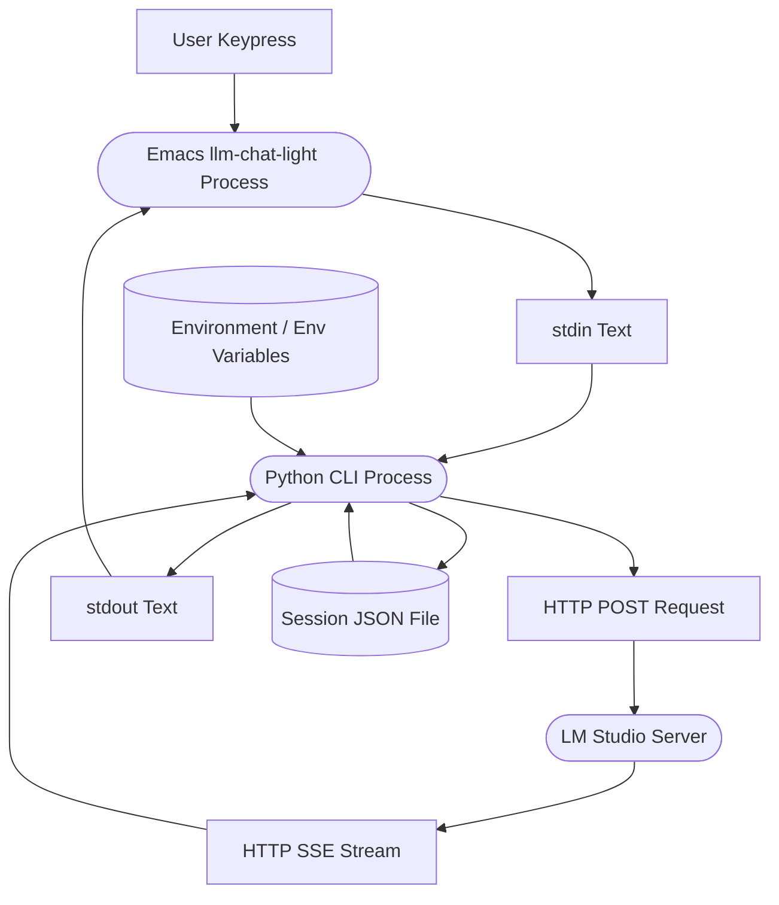

# llm-chat-light.el — Light Chat Client for Local LM Studio Server

[日本語版 (Japanese Version)はこちら](README_ja.md)

`llm-chat-light` is a lightweight, asynchronous Emacs chat client designed for interacting with local LM Studio server. 
It features a hybrid architecture combining a native Emacs Lisp UI (extending `comint-mode` to adopt a similar user experience to the built-in `shell-mode`) and a Python CLI backend to ensure reliable stream handling and robust session persistence.

---

## Features

- **Adaptive Syntax Highlighting**: Assistant responses and prompts are automatically colorized using customizable Emacs faces (`llm-chat-light-assistant`).
- **Stateless History Resiliency**: Message history is saved client-side in JSON files. If the server is restarted or memory context expires, the client automatically formats the entire history and transfers it statelessly to seamlessly restore the conversation.
- **Interactive Control commands**: Quickly switch sessions, dynamic model loading, Reasoning (thinking) level select, session deletion, and request cancellation.

---

## Requirements

- **Emacs 27.1** or newer.
- **Python 3.11** or newer.
- **uv** (Python package manager, recommended for fast sandboxed dependencies loading).
- **LM Studio** (running local server).

---

## Installation

Add the directory containing `llm-chat-light.el` to your load-path and require the package:

```elisp
(add-to-list 'load-path "/path/to/llm-chat-light/")
(require 'llm-chat-light)
```

To run a session, invoke the interactive command:

```elisp
M-x llm-chat-light-start
```

---

## Configuration

You can customize the following variables using `M-x customize-group RET llm-chat-light RET`:

| Variable | Default Value | Description |
| :--- | :--- | :--- |
| `llm-chat-light-program` | `"uv"` | Executable to launch the client. |
| `llm-chat-light-arguments` | `'("run" "python" "-u" "src/chat_agent/cli.py")` | CLI program launch arguments. |
| `llm-chat-light-api-base` | `"http://localhost:1234/v1"` | LLM API Server base URL. |
| `llm-chat-light-model` | `"unsloth/gemma-4-12b-it"` | Default LLM model name. |
| `llm-chat-light-default-reasoning` | `"none"` | Default reasoning mode parameter (`none`, `off`, `low`, `medium`, `high`, `on`). |
| `llm-chat-light-system-prompt` | *(Japanese instruction)* | Global instructions loaded into system role at session start. |
| `llm-chat-light-session-directory` | `~/.emacs.d/llm-chat-light/session/` | Directory where session JSON history is stored. |

---

## Keybindings

Within the `llm-chat-light-mode` buffer, the following keybindings are available:

| Keybinding | Command | Description |
| :--- | :--- | :--- |
| `RET` / `C-m` | `llm-chat-light-send-input` | Sends the current prompt. Inserts newline if cursor is in middle of buffer. |
| `C-c C-c` | `llm-chat-light-interrupt` | Interrupts/kills the current streaming request. |
| `C-c C-s` | `llm-chat-light-switch-session` | Switches to an existing session or creates a new one. |
| `C-c C-m` | `llm-chat-light-change-model` | Queries available models on server and dynamically switches model. |
| `C-c C-r` | `llm-chat-light-select-reasoning` | Dynamically selects the reasoning level (e.g. none, low, medium, high). |
| `C-c C-d` | `llm-chat-light-delete-session` | Deletes the current session file and kills the buffer. |

---

## Architecture



- **Emacs UI (Client)**: Handles rendering, comint buffer keymaps, header updates, and user input capture.
- **Python CLI (Backend)**: Decouples network logic, implements SSE HTTP stream parsing, formats past dialog history for the API payload, and dynamically read/writes to the session JSON storage files.
