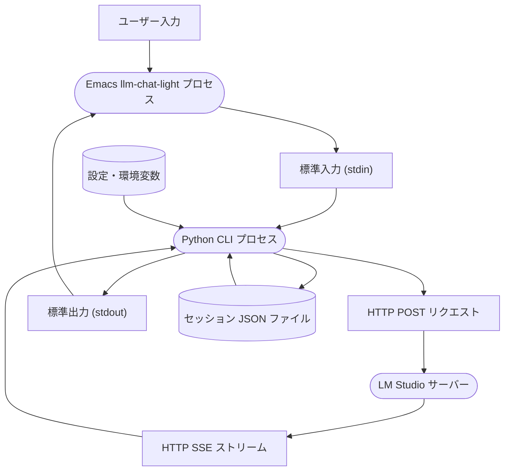

# llm-chat-light.el — ローカル LM Studio サーバー向け軽量チャットクライアント

[English Version (英語版)はこちら](README.md)

`llm-chat-light` は、ローカルで動作する LM Studio サーバーと非同期に通信・対話を行うための軽量な Emacs チャットクライアントパッケージです。
ネイティブな Emacs Lisp UI（`comint-mode` を拡張し、標準の `shell` モードと同様の対話型インターフェースを踏襲）と Python CLI バックエンドを組み合わせたハイブリッド構成により、信頼性の高いストリーム処理と堅牢なセッション永続化を実現しています。

---

## 主な特徴

- **レスポンス自動着色**: アシスタントの返答やプロンプトは、カスタマイズ可能な専用フェイス（`llm-chat-light-assistant`）によって自動的に色付けされ、高い視認性を保ちます。
- **クライアント側でのセッション復元機能 (Stateless履歴送信)**: 会話履歴はローカルに JSON ファイルとして保存されます。万が一サーバーが再起動したりメモリキャッシュが失われたりした場合でも、クライアント側が自動的にこれまでの会話履歴をプレーンテキストに再構築して送信するため、シームレスに会話を継続できます。
- **インタラクティブな制御コマンド**: セッションの切り替え、モデルの動的ロード、思考（Reasoning）レベルの変更、セッション削除、リクエストの強制中断などをキーボード操作で簡単に行えます。

---

## 動作要件

- **Emacs 27.1** 以上。
- **Python 3.11** 以上。
- **uv** (Python のパッケージマネージャー。高速な依存関係の自動ロードに推奨)。
- **LM Studio** (ローカルサーバーの起動)。

---

## インストール方法

### 手動インストール

`llm-chat-light.el` が置かれているディレクトリを `load-path` に追加し、パッケージをロードします。

```elisp
(add-to-list 'load-path "/path/to/llm-chat-light/")
(require 'llm-chat-light)
```

チャットを開始するには、以下のインタラクティブコマンドを実行します。

```elisp
M-x llm-chat-light-start
```

### `use-package` によるインストール (Emacs 29以上)

Emacs 29以上で標準搭載された `package-vc` 機能を利用して、GitHub から直接クローンしてインストールおよび設定を行うことも可能です。

```elisp
(use-package llm-chat-light
  :vc (:url "https://github.com/ifritJP/llm-chat-light"
       :rev :newest)
  :commands (llm-chat-light-start)
  :bind ("C-c L" . llm-chat-light-start)
  :custom
  (llm-chat-light-model "unsloth/gemma-4-12b-it"))
```

---

## カスタマイズ変数

`M-x customize-group RET llm-chat-light RET` を実行することで、以下の変数をカスタマイズできます。

| 設定変数 | デフォルト値 | 説明 |
| :--- | :--- | :--- |
| `llm-chat-light-program` | `"uv"` | クライアントプロセスを起動する実行ファイル名。 |
| `llm-chat-light-arguments` | `'("run" "python" "-u" "src/chat_agent/cli.py")` | CLI プログラムの起動引数リスト。 |
| `llm-chat-light-api-base` | `"http://localhost:1234/v1"` | LLM API サーバーのベース URL。 |
| `llm-chat-light-model` | `"unsloth/gemma-4-12b-it"` | 使用するデフォルトの LLM モデル名。 |
| `llm-chat-light-default-reasoning` | `"none"` | 思考（Reasoning）パラメータのデフォルト値 (`none`, `off`, `low`, `medium`, `high`, `on`)。 |
| `llm-chat-light-system-prompt` | *(日本語による指示文)* | セッション開始時に system ロールとして渡されるシステムプロンプト。 |
| `llm-chat-light-session-directory` | `~/.emacs.d/llm-chat-light/session/` | セッション JSON ファイルを保存するディレクトリ。 |

---

## キーバインド一覧

`llm-chat-light-mode` のバッファ内では、以下のショートカットキーが有効です。

| キーバインド | 実行コマンド | 説明 |
| :--- | :--- | :--- |
| `RET` / `C-m` | `llm-chat-light-send-input` | プロンプトを送信します。カーソルがバッファの途中にある場合は改行を挿入します。 |
| `C-c C-c` | `llm-chat-light-interrupt` | 現在受信中のストリーミング応答を強制終了します。 |
| `C-c C-s` | `llm-chat-light-switch-session` | 既存のセッションを切り替えるか、新規セッションを作成します。 |
| `C-c C-m` | `llm-chat-light-change-model` | サーバー上の有効なモデル一覧を取得し、動的にロードするモデルを切り替えます。 |
| `C-c C-r` | `llm-chat-light-select-reasoning` | 思考（Reasoning）レベル（none, low, medium, high 等）を動的に切り替えます。 |
| `C-c C-d` | `llm-chat-light-delete-session` | 現在のセッションの JSON ファイルを物理削除し、バッファを閉じます。 |

---

## アーキテクチャ構成図



- **Emacs UI (クライアント)**: 表示の描画、キーバインドの制御、ヘッダーの更新、ユーザー入力の標準入力への転送を担当します。
- **Python CLI (バックエンド)**: 通信処理全般を非同期化し、SSE ストリームのパース、会話履歴の JSON ファイルへの読み書き、およびサーバー送信用のコンテキスト整形処理を担当します。
