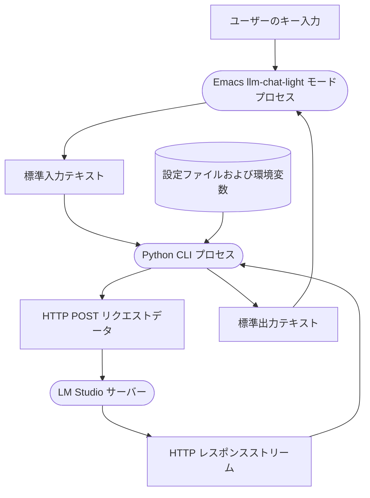

# アーキテクチャ設計書 v1 (llm_chat_light)

本ドキュメントは、EmacsからPython経由でLLMサーバ（LM Studio等）と対話するための `llm_chat_light` モードのシステムアーキテクチャおよびデータフローについて説明します。

## データフロー図 (DFD)

## データフローの説明

1. **ユーザーのキー入力 (データ / 状態)**
   - Emacsの `llm_chat_light` 専用バッファ上で、ユーザーがLLMへのプロンプトを入力し、送信キー（`RET` など）を押下したデータ。
   
2. **Emacs llm-chat-light モードプロセス (処理 / プロセス)**
   - Emacs Lispで実装される対話型（comint拡張）UIプロセス。ユーザーの入力をキャプチャし、非同期に起動された Python CLI プロセスの標準入力へと転送します。また、Python CLI の標準出力から受け取ったテキストをリアルタイムでバッファに挿入・表示します。

3. **標準入力テキスト (データ / 状態)**
   - EmacsからPython CLIに渡されるプレーンテキスト形式のプロンプト。

4. **Python CLI プロセス (処理 / プロセス)**
   - Pythonで実装される仲介CLIプログラム。標準入力からプロンプトを読み込み、指定されたLLMサーバーのAPI仕様（例: OpenAI互換のチャット補完API）に適合するJSONリクエストを組み立てて送信します。また、LM Studio等からのストリーミング応答をパースし、標準出力にそのまま流し込みます。
   - 拡張性のため、LLMクライアント部分は抽象化され、LM Studioや他のLLM API（OpenAI, Anthropic等）への切り替えが容易な設計とします。

5. **設定ファイルおよび環境変数 (データストア)**
   - APIキー、エンドポイントURL、モデル名などの接続情報を保持するデータストア。

6. **HTTP POST リクエストデータ (データ / 状態)**
   - Python CLIがLLMサーバーへ送信するHTTPリクエスト（JSONボディ）。

7. **LM Studio サーバー (処理 / プロセス)**
   - ローカルまたはリモートで稼働するLLM推論サーバー。

8. **HTTP レスポンスストリーム (データ / 状態)**
   - サーバーから返却される、サーバー送信イベント（SSE）などのストリーミングテキスト応答。

9. **標準出力テキスト (データ / 状態)**
   - Python CLIが標準出力に出力するレスポンステキスト。Emacs側で非同期に受信されます。

## アーキテクチャの問題点と移行について

セッション JSON ファイルへのメッセージ追加・保存処理について、当初は Emacs Lisp 側が正規表現等による出力パースを介して書き戻す設計になっていました。
しかし、この設計には以下の問題がありました：
1. **競合リスク**: Emacs と Python の両方が同じセッションファイルを更新し得るため、書き込みタイミングによって競合や履歴の重複・欠損が発生する恐れがある。
2. **CLI単独時の不整合**: Python CLI を直接ターミナルから単体実行した場合、履歴の保存が行われない。
3. **パースの複雑さ**: Emacs 側でストリーム出力バッファから ANSI カラーやプロンプト文字を正規表現で削ぎ落としてアシスタントの返答を再構築する処理は、バグの温床になりやすい。

上記の問題を解決するため、セッション JSON ファイルの読み書き担当を **Python CLI プロセスに一元化**しました。
新しいデータフローおよび DFD については、[アーキテクチャ設計書 v2](file:///proj/work/uv/chat_agent/docs/architecture_02.md) を参照してください。

