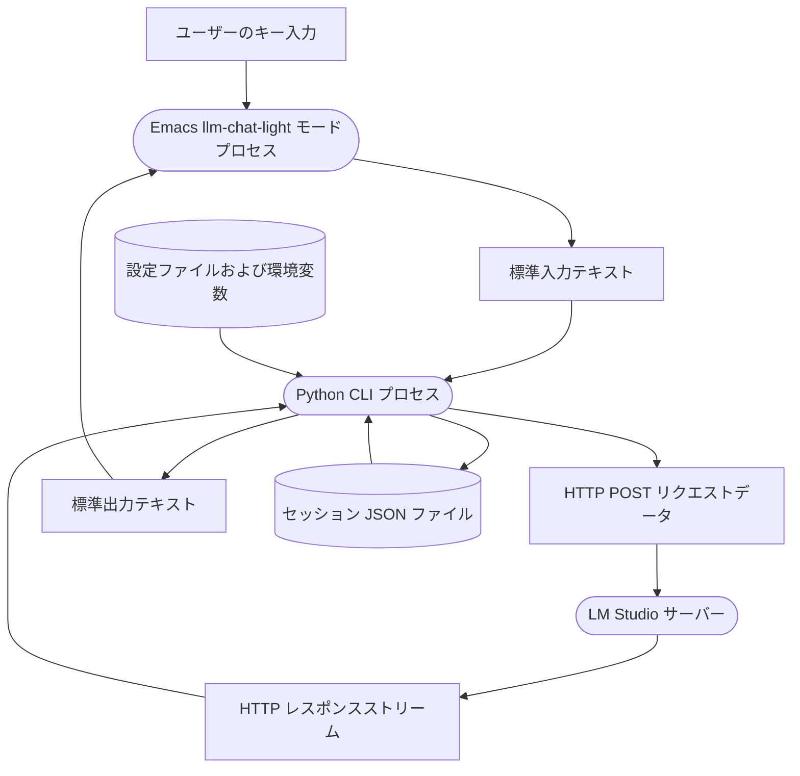

# アーキテクチャ設計書 v2 (llm_chat_light)

本ドキュメントは、セッション履歴の保存・更新を一元化し、EmacsとPython間の競合を排除した `llm_chat_light` のシステムアーキテクチャおよびデータフローについて説明します。

## データフロー図 (DFD)

## データフローの説明

1. **ユーザーのキー入力 (データ / 状態)**
   - Emacsの `llm_chat_light` 専用バッファ上で、ユーザーがLLMへのプロンプトを入力し、送信キー（`RET` など）を押下したデータ。
   
2. **Emacs llm-chat-light モードプロセス (処理 / プロセス)**
   - Emacs Lispで実装される対話型 UI プロセス。ユーザーの入力をキャプチャし、非同期に起動された Python CLI プロセスの標準入力へと転送します。また、Python CLI の標準出力から受け取ったテキストをリアルタイムでバッファに挿入・表示します。

3. **標準入力テキスト (データ / 状態)**
   - EmacsからPython CLIに渡されるプレーンテキスト形式のプロンプト。

4. **Python CLI プロセス (処理 / プロセス)**
   - Pythonで実装される仲介CLIプログラム。
   - 起動時に `SessionStore` から過去のメッセージ履歴を読み込みます。
   - ユーザー入力受信時に `SessionStore` に最新 of メッセージ履歴を書き出します。
   - LLMからの応答受領完了時にも `SessionStore` にメッセージ履歴を書き出します。
   - APIキーやモデル名に基づいてリクエストを組み立て、LM Studioに送信します。

5. **セッション JSON ファイル (データストア)**
   - 各チャットごとのメッセージ履歴（会話ログ）を JSON 配列形式で保持するファイル。Python CLI によって直接読み書きされます。

6. **設定ファイルおよび環境変数 (データストア)**
   - APIキー、エンドポイントURL、モデル名などの接続情報を保持するデータストア。

7. **HTTP POST リクエストデータ (データ / 状態)**
   - Python CLIがLLMサーバーへ送信するHTTPリクエスト（JSONボディ）。

8. **LM Studio サーバー (処理 / プロセス)**
   - ローカルまたはリモートで稼働するLLM推論サーバー。

9. **HTTP レスポンスストリーム (データ / 状態)**
   - サーバーから返却される、サーバー送信イベント（SSE）などのストリーミングテキスト応答。

10. **標準出力テキスト (データ / 状態)**
    - Python CLIが標準出力に出力するレスポンステキスト。Emacs側で非同期に受信されます。
